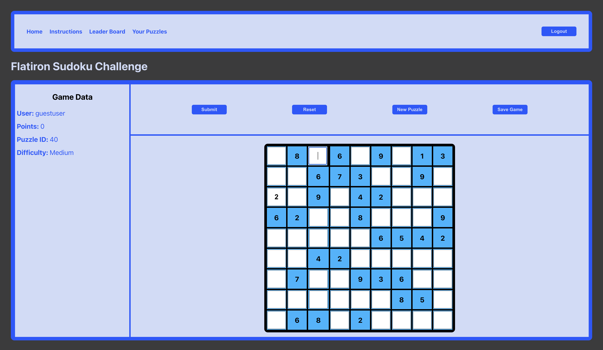

# Table 3 Phase 2 Project

## Home

* [Dependencies](#dependencies)
* [Starting the Application](#starting-the-application)
* [Using the Application](#using-the-application)
* [Optional Features](#optional-features)
* [Potential Improvements](#potential-improvements)
* [License](#license)
* [Attributions](#attributions)
* [What I Learned](#what-i-learned)

## Intro To Project

- This project is a site where a user can play `Sudoku`.
- This project was made to complete the assignment `Phase 2 Project` for the `SE-West-091123` class for the [Flatiron](https://flatironschool.com/) Software Engineering Boot Camp.
- The project was completed using the following: `JavaScript`, `HTML`, `CSS`, `React`.

## Dependencies

- The following is needed to run this application: `Node`, `JSON Server`.

- You must have access to these dependencies in the directory that you are running this application in. If your environment does not have these requirements, you may install them in this order by going to these websites and following the installation instructions:

- [Npm - Node.JS](https://www.npmjs.com/package/node)

- [Npm - JSON Server](https://www.npmjs.com/package/json-server)

## Starting the Application

- Make sure nothing is currently running on `http://localhost:3000` or on `http://localhost:3001`.
- Open a terminal window in the main directory of where this project is located on your computer.
- Run `npm install`.
- When the dependencies are finished loading, run `npm run server`.
- It should be running on `http://localhost:3001` and your terminal should look something like this:
- ==============================================
    
- ==============================================
- Open another terminal window in the main directory of where this project is located on your computer
- Run `npm start`.
- It should run on `http://localhost:3000` take you to a page that looks like this:
- ==============================================
    
- ==============================================

## Using the Application

- The user can sign in or create an account by inputting their email and password of choice, or stored password in they already have an account, and either clicking `Create Account` or `Login`
- The user can also click `Continue as Guest` to play without creating an account.
- Once the login process is complete, the will be taken to the `Home` page which will look like this:
- ==============================================
    
- ==============================================
- The app will load the user's last saved puzzle or randomly load one if one is not saved.
- If the user does not know how to play Sudoku, they can click on `Instructions` and they will be taken to a page of basic Sudoku instructions provided by `Sudoku.com`. the page looks like this:
- ==============================================
    
- ==============================================
- If the user doesn't want to work on the puzzle, they can click `New Puzzle` and the app will load another random puzzle.
- The user can also save the current puzzle on display to their personal stash of puzzles in the database by clicking `Save Game`.
- There is also a `Leader Board` which keeps track of all of the users scores in the database.
- ==============================================
    
- ==============================================
- And finally there is `Your Puzzles` which is a collection of the puzzles the user saves in the database. The user can scroll through the list and click on any puzzle. The puzzle clicked will then be displayed on the page and the user can work on that puzzle.
- ==============================================
    
- ==============================================

## Optional Features

- Unfortunately we were unable to complete any of the stretch goals we had originally planned.

## Potential Improvements

- There are plans for consumable items to assist the user in solving puzzles, a timer for the puzzles that will affect the user's score, and a way to spend points on display customization and the previously mentioned consumables.
- Definitely more CSS and styling upgrades.

## License

- This project is is made in conjunction with the standard `MIT` license provided by `GitHub` upon creation of a new repository. A copy of the license is included with this project in a file named: `LICENSE`.

## Attributions

- The project was completed with collaboration from: `Joseph Lee`, `Michael Phan`, and `Brian Richie Sr.`
- This project was created with combination of skills learned from the `Flatiron` curriculum and our own individual research.
- The data used to seed the original data prior to being modified for the purposes of this project was supplied by [Dosuku](https://https://sudoku-api.vercel.app/) created by `Raghav Gupta`.
- The instructions for the app for provided by [Sudoku.com](https://sudoku.com/how-to-play/sudoku-rules-for-complete-beginners/).
- And of course, thank you [Stack Overflow](https://stackoverflow.com/).

## What I Learned

- `Joseph`: 
- `Michael`:
- `Brian`:  I learned about more about React Routing. I learned more about the hooks `useParams` and `useNavigate`. And I also had a great time working on the project with the team. Which also taught me more about the importance of good communication and supporting one another throughout the project: Keeping each other grounded and on-task during the successful moments, and lifted each other up during the not-so successful moments. Thank you Joseph, Michael, and the `Flatiron` community.

* [Back To Top](#table-3-phase-2-project)
